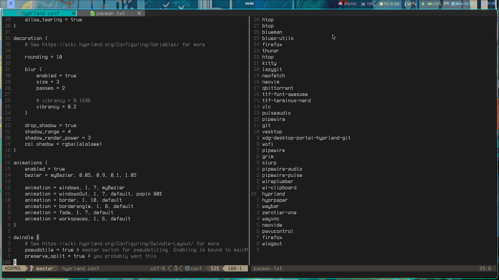
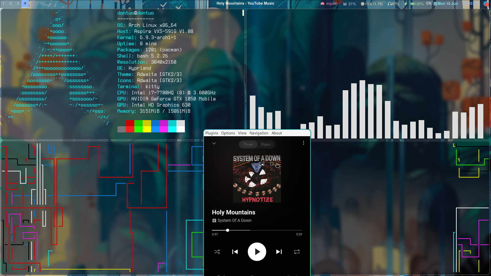

- **Window Manager** • [Hyprland](https://hyprland.org/)

- **Shell** • [Starship](https://github.com/starship/starship) 
- **Terminal** • [Kitty](https://sw.kovidgoyal.net/kitty/) 
- **Status bar** • [Waybar](https://github.com/Alexays/Waybar) 
- **Launcher** • [Wofi](https://sr.ht/~scoopta/wofi/)
- **File Manager** • [thunar](https://github.com/xfce-mirror/thunar) file manager
- **IDE** • [Neovim](https://neovim.io/) nvim like IDE

